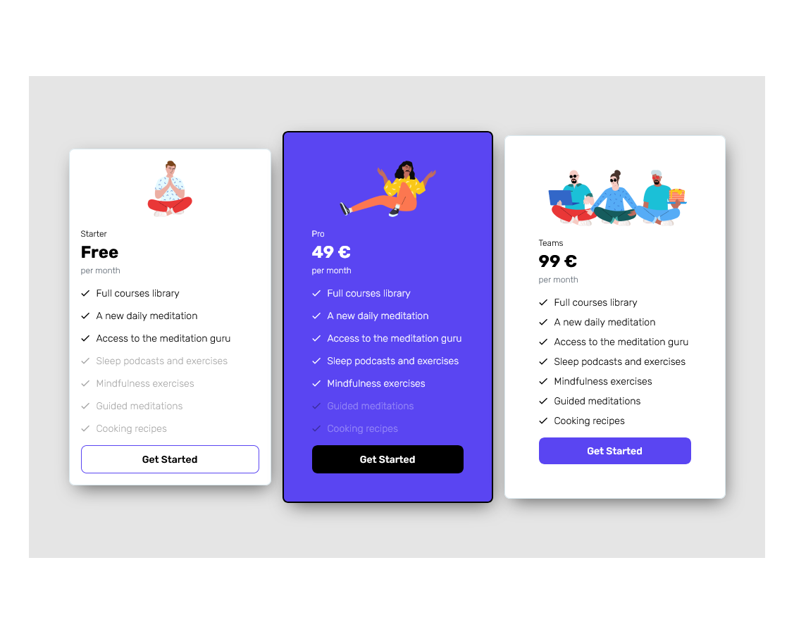
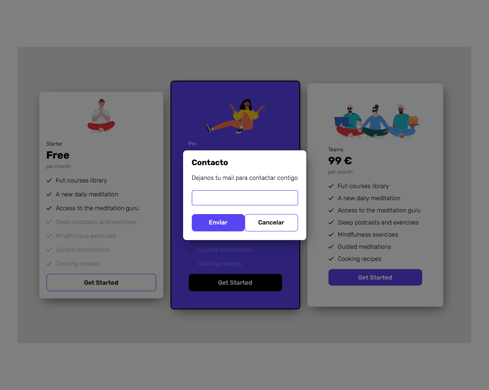

# Jump2Digital 2022 | Frontend

Esta es una solución al resto propuesto de un visualizador de planes de precio.

## Tabla de contenidos

- [Overview](#overview)
  - [The challenge](#the-challenge)
  - [Screenshot](#screenshot)
  - [Links](#links)
- [My process](#my-process)
  - [Built with](#built-with)
- [Author](#author)

## Overview

### El reto

- Los usuarios pueden ver el diseño en desktop y movil.
- Al clicar el botón aparece un cuadro de dialogo que nos pide un email y pronto se pondrán en contacto con nosotros.

### Pantallas

### Links

- Solution URL: [Git hub](https://github.com/ManuelFernandezEsteban/pricePlansComponent.git)
- Live Site URL: [Netlify](https://app.netlify.com/sites/pricecomponentjp/settings/general)

### Built with

- Angular
- Semantic HTML5 markup
- CSS custom properties
- Flexbox
- Mobile-first workflow
## Author

- linkedIn - [LinkedIn](www.linkedin.com/in/manuel-fernandez-esteban)

# PricePlansComponent

This project was generated with [Angular CLI](https://github.com/angular/angular-cli) version 14.2.1.

## Development server

Run `ng serve` for a dev server. Navigate to `http://localhost:4200/`. The application will automatically reload if you change any of the source files.

## Code scaffolding

Run `ng generate component component-name` to generate a new component. You can also use `ng generate directive|pipe|service|class|guard|interface|enum|module`.

## Build

Run `ng build` to build the project. The build artifacts will be stored in the `dist/` directory.

## Running unit tests

Run `ng test` to execute the unit tests via [Karma](https://karma-runner.github.io).

## Running end-to-end tests

Run `ng e2e` to execute the end-to-end tests via a platform of your choice. To use this command, you need to first add a package that implements end-to-end testing capabilities.

## Further help

To get more help on the Angular CLI use `ng help` or go check out the [Angular CLI Overview and Command Reference](https://angular.io/cli) page.

